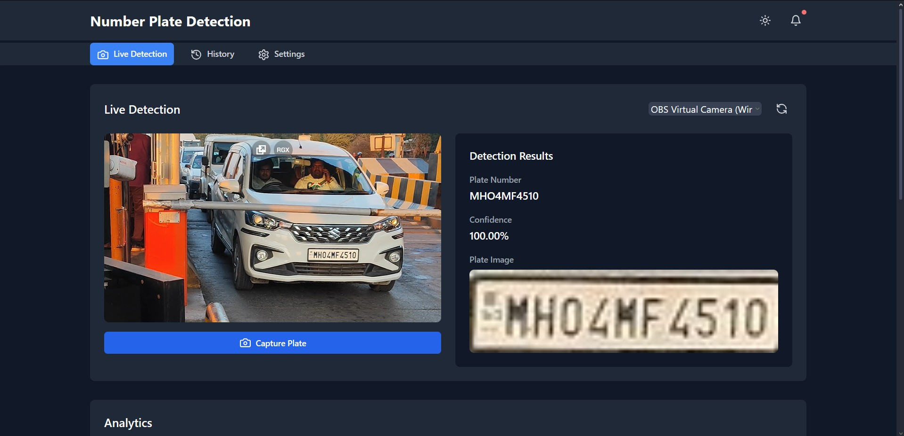

# Number Plate Detection System 🚗🔍

Automatic detection and recognition of vehicle number plates using advanced machine learning techniques.

---

## 🎯 Demo Outputs

### GIF Demo


### Image Result


---

## 📌 Project Overview

This is a full-stack application for automatic number plate detection and recognition. It leverages YOLOv5 for detecting number plates and PaddleOCR for recognizing characters from detected plates. Built with a Python-based backend and a React frontend for a user-friendly experience.

---

## 📂 Project Structure

```
project-root/
├── backend/
│   ├── model/
│   │   └── best.pt
│   ├── main.py
│   └── requirements.txt
└── frontend/
    ├── node_modules/
    ├── src/
    │   ├── components/
    │   ├── Dashboard.tsx
    │   ├── DetectionPanel.tsx
    │   ├── HistoryPanel.tsx
    │   ├── NotificationsPanel.tsx
    │   ├── NumberPlateDetection.tsx
    │   └── StatsPanel.tsx
    ├── styles/
    ├── App.tsx
    ├── index.css
    ├── main.tsx
    └── vite-env.d.ts
```

---


## 🚀 Quick Start


## 📥 Model Weights Download

You can download the pre-trained YOLOv5 model weights from the following link:

➡️ [Download Model Weights](https://drive.google.com/drive/folders/1jhmmizg8VguJ6kTWwjdQu7W7sPsMww8a?usp=drive_link)

Place the downloaded weights (`best.pt`) into the `backend/model/` directory.


### Clone Repository

```bash
git clone https://github.com/alok-ahirrao/Number-Plate-Detection-System.git
```

### Backend Setup

Navigate to the backend directory, install dependencies, and start the server:

```bash
cd backend
pip install -r requirements.txt
python main.py
```
Backend API runs at: [`http://localhost:8000`](http://localhost:8000)

### Frontend Setup

Navigate to the frontend directory, install dependencies, and start the development server:

```bash
cd frontend
npm install
npm run dev
```
Frontend app runs at: [`http://localhost:5173`](http://localhost:5173)

## Technologies Used

- FastAPI
- PyTorch
- YOLOv5
- PaddleOCR
- OpenCV
- React
- Vite

---

## 🤝 Contribution

Feel free to improve this project by submitting pull requests. Your contributions are welcome!

---

## 📜 License

Copyright © 2025, Alok Ahirrao

Licensed under the **Creative Commons Attribution-NonCommercial 4.0 International License**. You may use or modify this project for personal or educational purposes only. Commercial usage requires explicit permission.

For inquiries, please contact [alokahirrao.ai@gmail.com](mailto:alokahirrao.ai@gmail.com).

---

🌟 **Happy Coding!** 🌟

